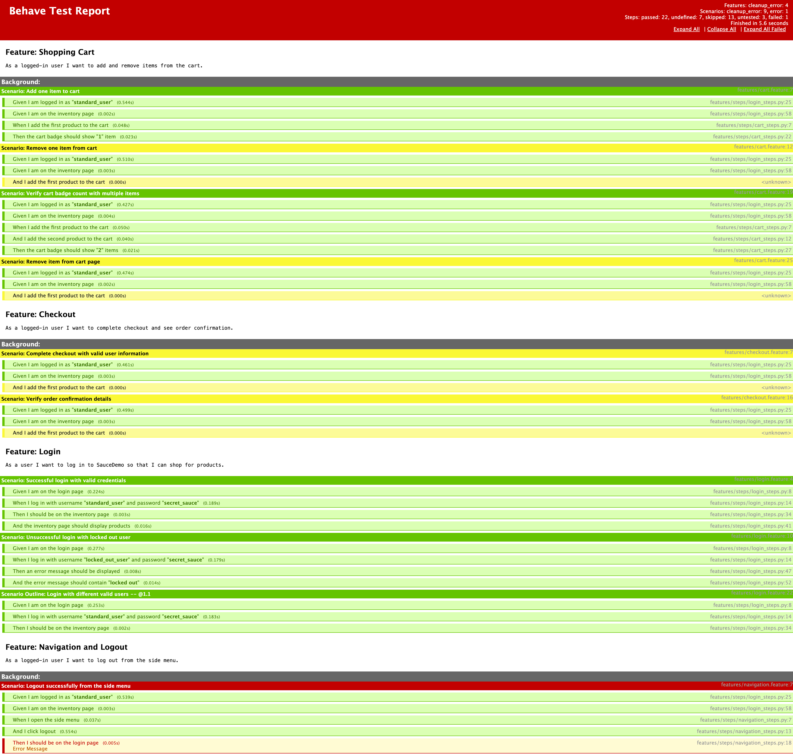

# SauceDemo BDD Automation Framework

A professional QA automation project for [SauceDemo](https://www.saucedemo.com) using **Python**, **Selenium WebDriver**, and **Behave** (BDD). Built with Page Object Model, config-driven settings, and clear structure.

---

## Purpose

This project demonstrates:

- **BDD** with Gherkin feature files and Behave
- **Page Object Model (POM)** for maintainable UI automation
- **Selenium** with explicit waits and reusable base page methods
- **Config and test data** separation
- **Logging** for scenario and key action visibility
- **Screenshots on failure** and Allure-ready reporting
- **GitHub Actions CI** to run tests on push/PR
- A **clean, recruiter-friendly** layout

---

## Tools Used

| Tool | Role |
|------|------|
| **Python 3** | Language |
| **Selenium 4** | Browser automation |
| **Behave** | BDD framework (Cucumber-style for Python) |
| **webdriver-manager** | Automatic ChromeDriver management |
| **Allure (optional)** | HTML reporting via `allure-behave` |

---

---

## Test Execution

Example BDD test run:



---

## Project Structure

```
saucedemo-bdd-automation-framework/
├── .github/
│   └── workflows/
│       └── ci.yml              # GitHub Actions: run Behave on push/PR
├── features/
│   ├── login.feature
│   ├── cart.feature
│   ├── checkout.feature
│   ├── navigation.feature
│   ├── environment.py         # Hooks: driver, screenshot on failure, logging
│   └── steps/
│       ├── login_steps.py
│       ├── cart_steps.py
│       ├── checkout_steps.py
│       └── navigation_steps.py
├── pages/
│   ├── base_page.py           # Reusable waits, find, click, send_keys
│   ├── login_page.py
│   ├── inventory_page.py
│   ├── cart_page.py
│   ├── checkout_page.py
│   └── menu_page.py
├── utils/
│   ├── config_reader.py
│   ├── logger.py
│   └── test_data.py           # Users, checkout data
├── config/
│   └── config.json            # base_url, browser, timeouts
├── reports/                   # Allure/HTML output
├── screenshots/               # Failure screenshots (uploaded in CI on failure)
├── behave.ini
├── requirements.txt
└── README.md
```

---

## Framework Design

- **Page Object Model**: Each page (Login, Inventory, Cart, Checkout, Menu) has its own class with locators and actions. Assertions live in step definitions, not in page classes.
- **Base page**: Shared methods for explicit waits (`find`, `find_clickable`, `find_visible`), `click`, `send_keys`, `get_text`, and `is_displayed`.
- **Config**: `config/config.json` holds base URL, browser, implicit/explicit timeouts, and screenshot-on-failure flag. For a larger project, consider `python-dotenv` + YAML or **Pydantic Settings** for validation and env overrides.
- **Test data**: `utils/test_data.py` centralizes user credentials and checkout info so features stay readable and data is easy to change.
- **Hooks**: `environment.py` starts the browser per scenario, logs scenario start/pass/fail, captures a screenshot on failure, and quits the driver after all scenarios. In CI (`CI=true`), Chrome runs headless.
- **Logging**: A simple logger writes to stdout (scenario names, key actions like login and checkout). Helps trace failures and fits CI logs.

---

## Scenarios Covered

| Feature | Scenarios |
|---------|-----------|
| **Login** | Successful login (standard_user), locked out user error, scenario outline for valid users |
| **Cart** | Add one item, remove one item (inventory and cart page), cart badge count, multiple items |
| **Checkout** | Full checkout with valid info, order confirmation message |
| **Navigation** | Logout from the side menu, land back on login page |

Credentials used: `standard_user` / `secret_sauce`, `locked_out_user` / `secret_sauce` (negative case).

---

## Installation

1. **Clone the repo** 

2. **Create and activate a virtual environment:**
   ```bash
   python3 -m venv .venv
   source .venv/bin/activate   # Windows: .venv\Scripts\activate
   ```

3. **Install dependencies:**
   ```bash
   pip install -r requirements.txt
   ```

4. **Chrome**: Ensure Chrome is installed. `webdriver-manager` will download the matching ChromeDriver on first run (requires network access).

---

## How to Run Tests

From the **project root**:

```bash
# Run all features
behave

# Run a single feature
behave features/login.feature

# Run with console output not captured (see print/logs)
behave --no-capture

# Run by tag (if you add tags later)
behave --tags=@login
```

---

## CI (GitHub Actions)

The repo includes a workflow that runs the test suite on every push and pull request to `main` or `master`.

- **Workflow file**: `.github/workflows/ci.yml`
- **Steps**: Checkout → Set up Python 3.11 → Install dependencies → Run `behave --no-capture`
- **Environment**: `CI=true` is set so the framework runs Chrome in headless mode on the runner.
- **On failure**: The `screenshots/` directory is uploaded as an artifact so you can download failure screenshots from the Actions run.

---

## Reports and Screenshots

- **Failure screenshots**: On scenario failure, a screenshot is saved under `screenshots/` and embedded in the Behave report when using the default formatter.
- **HTML report (good for portfolio)**: Generate a single HTML file you can open in a browser or screenshot:
  ```bash
  mkdir -p reports
  behave -f html -o reports/behave-report.html
  ```
  Open `reports/behave-report.html` in a browser. Take a screenshot of the report (or the terminal after `behave`) to use on your portfolio or in the README.
- **Allure**: For richer HTML reports, install Allure and use the Allure formatter:

  1. In `behave.ini`, uncomment:
     ```ini
     format = allure_behave.formatter:AllureFormatter
     outfiles = reports/allure-results
     ```
  2. Run tests: `behave`
  3. Generate and open report:
     ```bash
     allure generate reports/allure-results -o reports/allure-report --clean
     allure open reports/allure-report
     ```
---

## License

MIT

---

